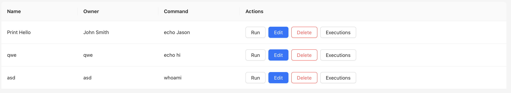
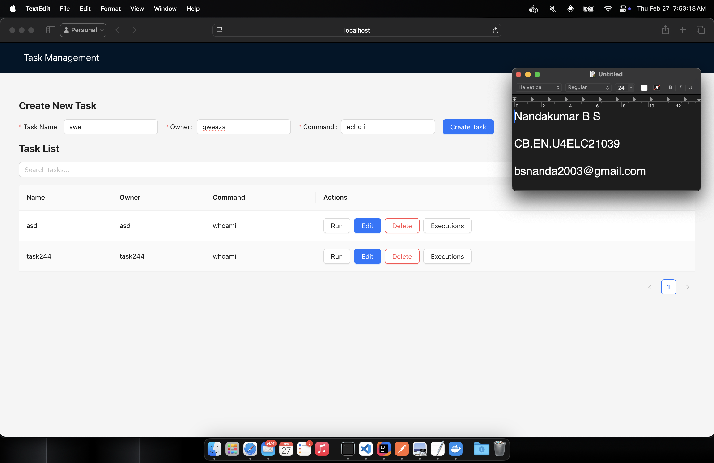
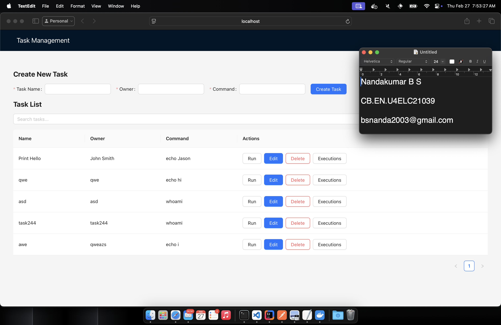
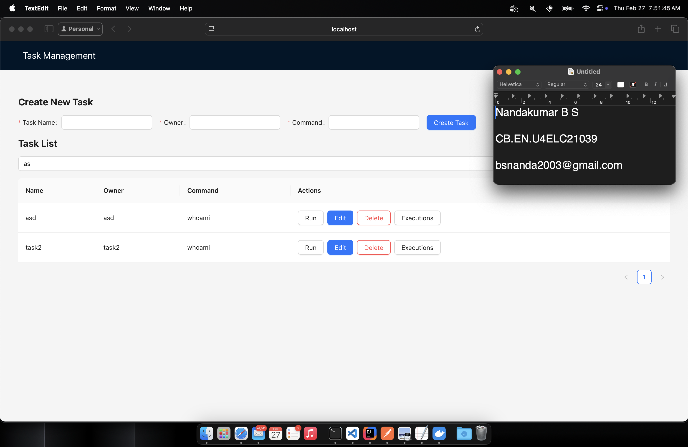
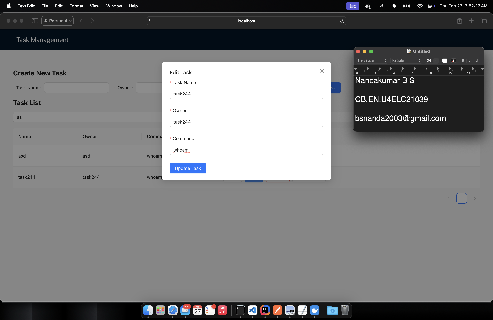
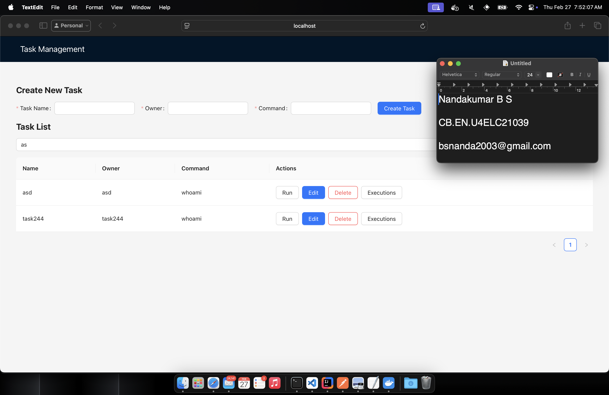
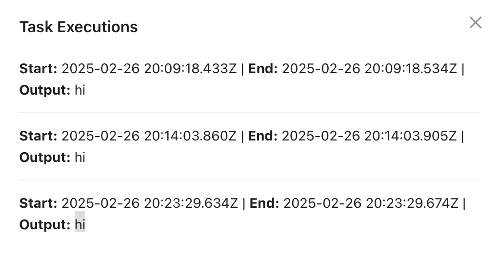

# Task 3. WEB UI Forms

This part involves creating a full-stack application that allows users to create, search, and manage tasks that represent shell commands to be executed. The backend is built with Spring Boot and stores task data in MongoDB, while the frontend is developed using React 19, TypeScript, and Ant Design.


## Features

- Create new tasks with ID, name, owner, and command.
- Search for tasks by name.
- View existing tasks and their execution status.
- Backend connectivity with Spring Boot REST API.
- Store and retrive data from MongoDB.


## Packages Used
- React
- Ant Design
- Axios

## Installation

Install dependencies and start the server
```bash
  npm install
  npm start
```
# Application Overview

### Home Page (Task Management Dashboard)


The main dashboard allows users to:

- Search for tasks by name.

- Create new tasks with ID, name, owner, and command.

- View existing tasks and their execution status.


### New Task Component

This form allows users to create new tasks by providing:

    - Task ID

    - Task Name

    - Owner Name

    - Shell Command to Execute

### Backend Connectivity

The frontend communicates with the Spring Boot REST API, sending POST and GET requests.

### Search Component

Users can search for tasks by name using this component.

### Backend Data Verification

After creating tasks, they are stored in MongoDB and can be retrieved.

## API Endpoints

`PUT /tasks` - Add a new task

`GET /tasks/{id}` - Get a task by ID

`GET /tasks` - Get all tasks

`PUT /tasks/{id}` - Update a task

`DELETE /tasks/{id}` - Remove a task

`PUT /tasks/{id}/execute` - Get Task by ID and execute the command in shell

`GET /tasks/search?name={taskName}` - Search task by name

`GET /tasks/{id}/executions` - Fetch execution history


Screenshots

### Task List View


### Creating a Task




### Update Task
Here task `Task Name : task2` and `Owner : task 2` is updated to `Task Name : task244` and `Owner : task 244`








### Executions
After executing a task , each execution is saved and dispayed in the `Executions` pane.



## Conclusion

A full-stack implementation of a task management application with a React frontend, Spring Boot backend, and MongoDB storage