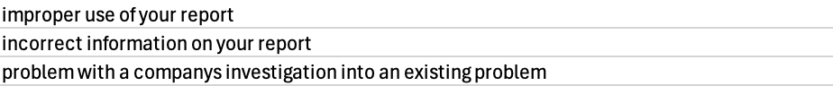
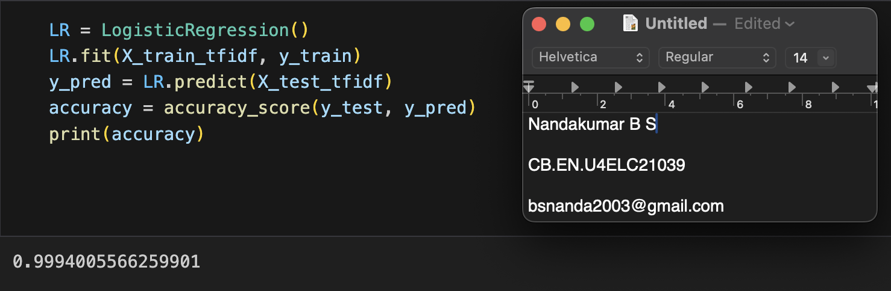
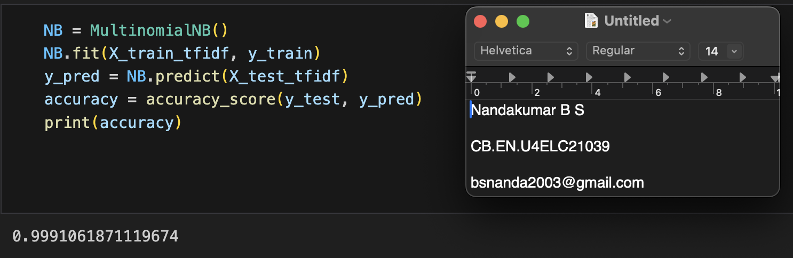
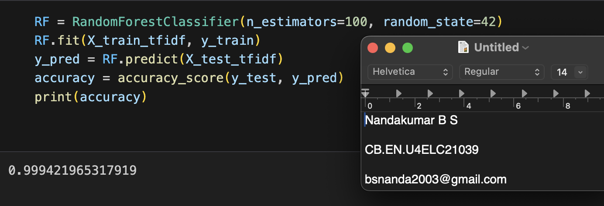
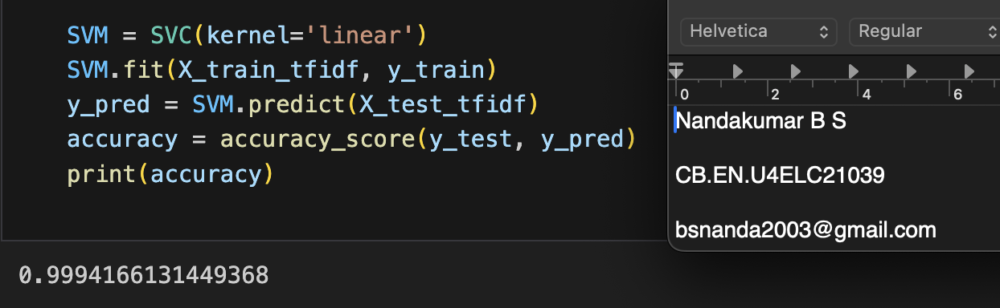
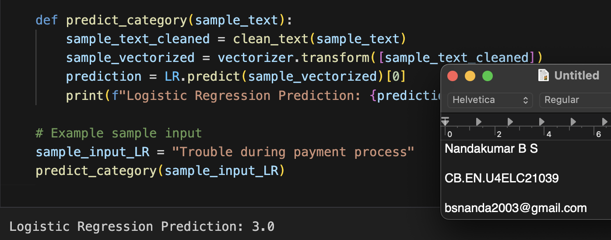
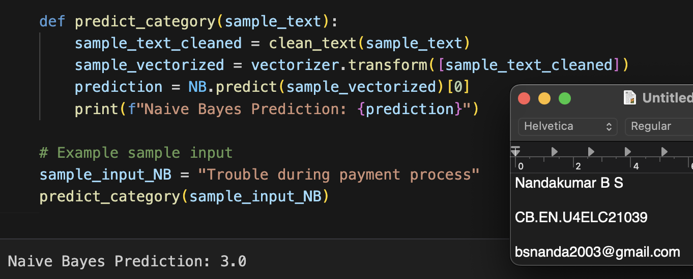
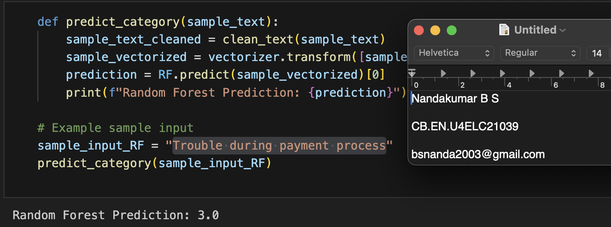
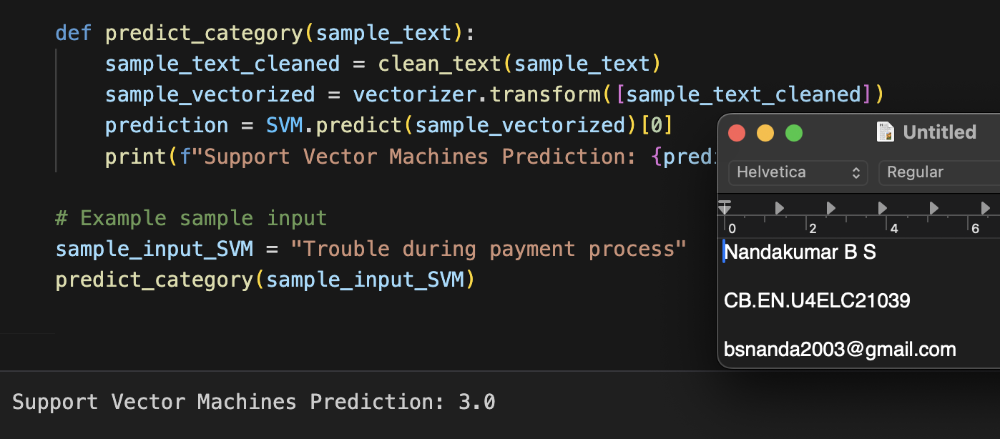

# Task 5. Data Science example

This task focuses on classfying complaints using machine learning models. The dataset undergoes preprocessing, including text cleaning and feature extraction, before being used for classification.

- Dataset used : https://catalog.data.gov/dataset/consumer-complaint-database

- Categories 

        Credit reporting, repair, or other      -   0
        Debt collection                         -   1
        Consumer Loan                           -   2
        Mortgage                                -   3

### Steps

- Load the dataset.

- Preprocess text data (cleaning, removing stopwords, etc.).

- Convert text into numerical features (TF-IDF, word embeddings, etc.).

- Train multiple machine learning models.

- Evaluate and compare model performance.

- Make predictions on new complaint data.

### Models Used

- Logistic Regression

- Naive Bayes

- Random Forest

- Support Vector Machine (SVM)

### Installation
```bash
pip install numpy pandas scikit-learn nltk
```

## Data Preprocessing

- Text Cleaning: Removing stopwords, punctuation, and special characters.
```python
def clean_text(text):
    text = text.lower()
    text = re.sub(f"[{string.punctuation}]", "", text)
    text = re.sub(r'\d+', '', text)
    return text

df['Cleaned_Issue'] = df['Issue'].apply(clean_text)
```
Sample Clean Text :

- Feature Extraction: Converting text into numerical features using TF-IDF.
```python
X_train, X_test, y_train, y_test = train_test_split(df['Cleaned_Issue'], df['Category'], test_size=0.2, random_state=42)
vectorizer = TfidfVectorizer()
X_train_tfidf = vectorizer.fit_transform(X_train)
X_test_tfidf = vectorizer.transform(X_test)
```

## Accuracy reports
### Logistic Regression


### Naive Bayes


### Random Forest


### Support Vector Machine (SVM)


## Prediction Results
With the test results , we try to predict `Trouble during payment process` with ML Models
### Logistic Regression


### Naive Bayes


### Random Forest


### Support Vector Machine (SVM)


## Conclusion
This notebook compares different ML models based on their classification accuracy and other evaluation metrics.
