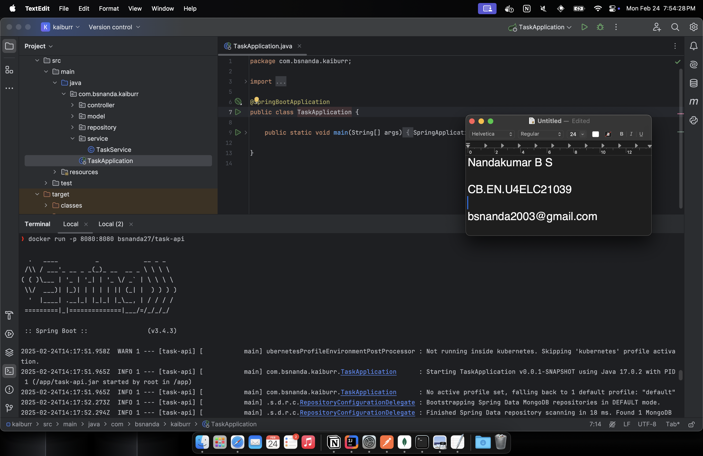
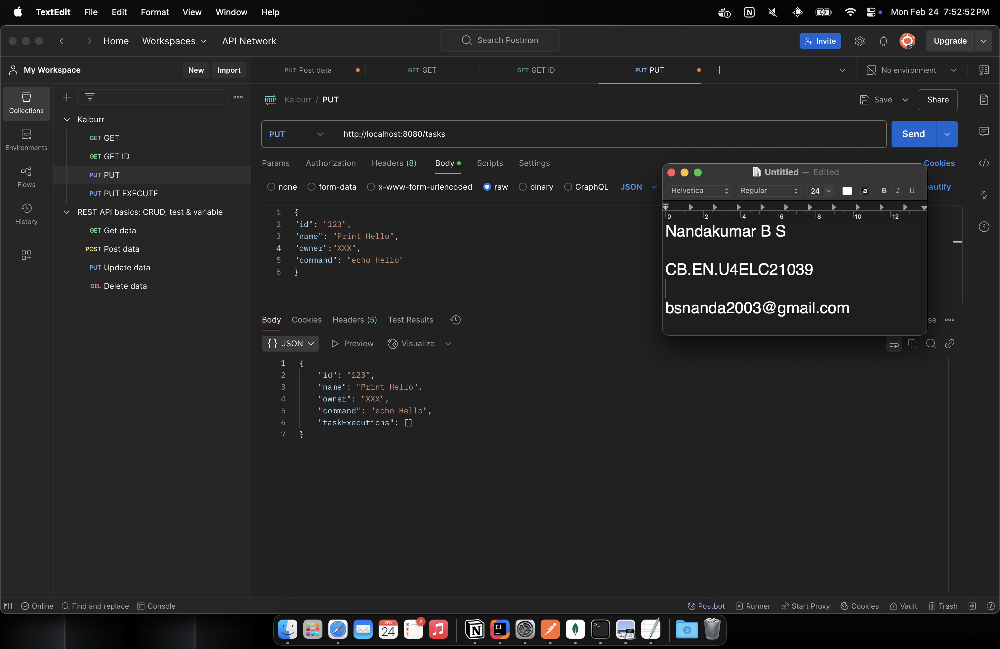
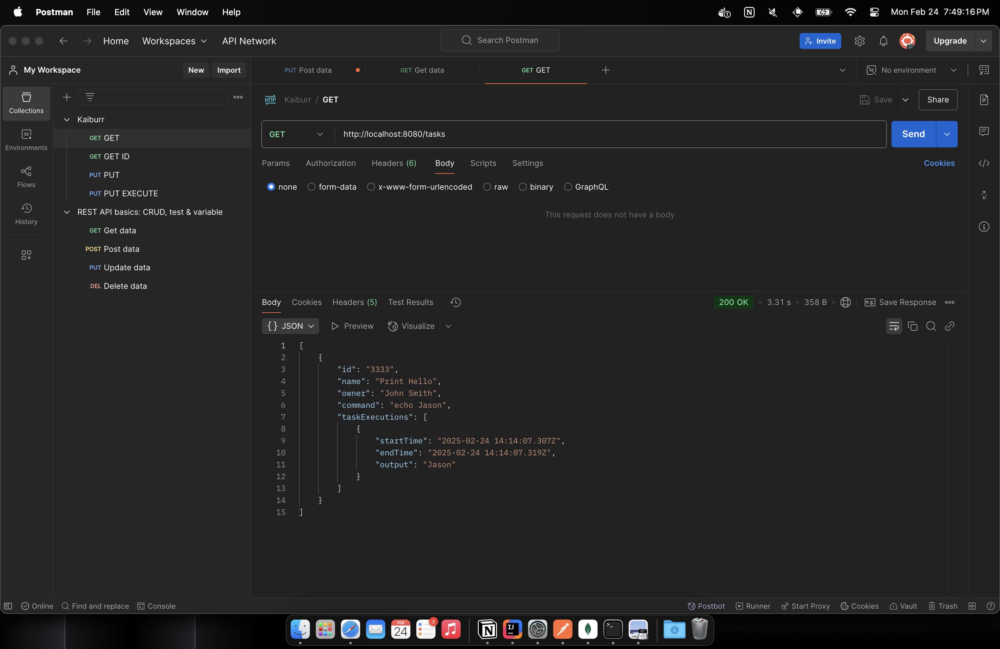
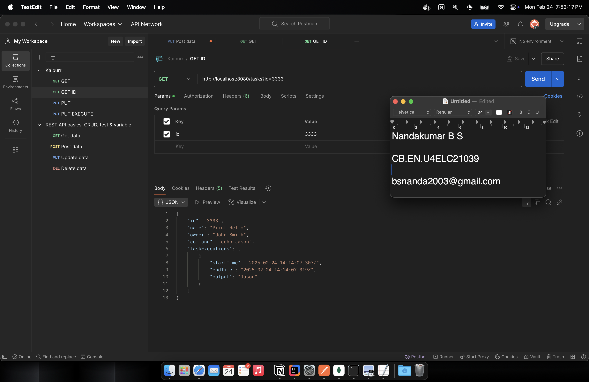
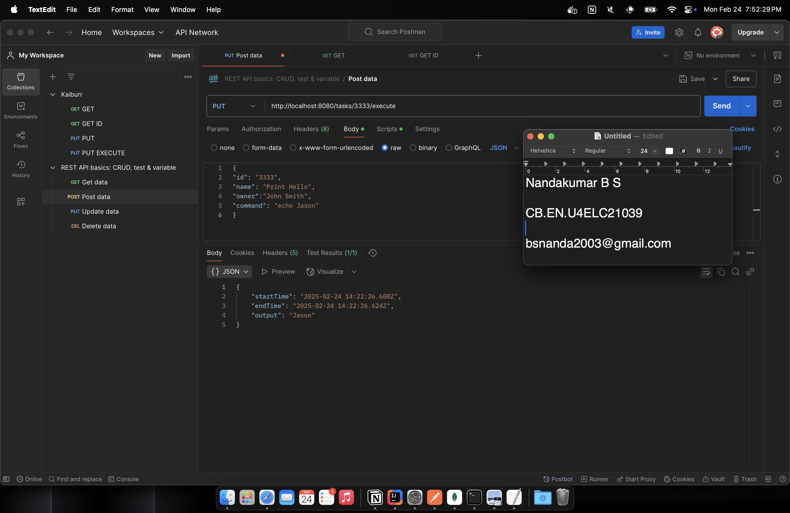
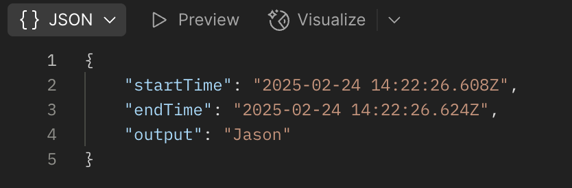
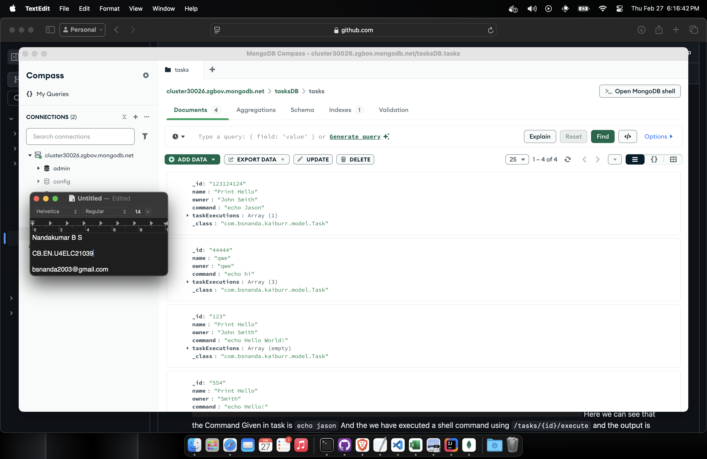

# Task 1 : Java backend and REST API example

A Java-based task management system that handles task creation, execution, and storage. This project includes a REST API built using Spring Boot.


## Features

- Create and manage tasks
- Run tasks
- Save tasks in a database
- Logic handled in a service layer


## Technologies Used

- Java
- Spring Boot
- Maven
- MongoDB


## Installation

```bash
  mvn clean package
  mvn spring-boot:run
```


    
## Usage

Available API endpoints:
- `PUT /tasks` - Add a new task
- `GET /tasks/{id}` - Get a task by ID
- `GET /tasks` - Get all tasks
- `PUT /tasks/{id}` - Update a task
- `DELETE /tasks/{id}` - Remove a task
- `PUT /tasks/{id}/execute` - Get Task by ID and execute the command in shell

You can use Postman or `curl` to interact with the RESTful APIs.


## Screenshots


This screenshot shows - Backend Running (Spring Boot)



This screenshot shows Creating a New Task



This screenshot shows Fetching All Tasks



This screenshot shows Fetching Task by its ID (TaskID)



This screenshot shows Executing a Task by its ID



Here we can see that the Command Given in task is `echo jason`
And the we have executed a shell command using `/tasks/{id}/execute` and the output is stored in MongoDB database - `tasksDB`


This screenschot shows the data stored in a database `tasksDB` in MongoDB

You can Also You these `curl` command to test the APIs

- Create A Task

```bash
curl -X PUT http://localhost:8080/tasks \
     -H "Content-Type: application/json" \
     -d '{
           "id": "123",
           "name": "Print Hello",
           "owner": "John Smith",
           "command": "echo Hello World!"
         }'
```

- GET All Tasks

```bash
curl -X GET http://localhost:8080/tasks
```

- GET Tasks by ID
```bash
curl -X GET "http://localhost:8080/tasks?id=123"
```

- Search Tasks by name
```bash
curl -X GET "http://localhost:8080/tasks/search?name=Print"
```

- Execute A Task By ID
```bash
curl -X PUT http://localhost:8080/tasks/123/execute
```

- Delete a Task By ID
```bash
curl -X DELETE http://localhost:8080/tasks/123
```


## Conclusion
The Java backend task successfully implemented a RESTful API built with Spring Boot and MongoDB. It demonstrates key concepts such as CRUD operations, database interactions, and service-layer logic for a Task Manager.
